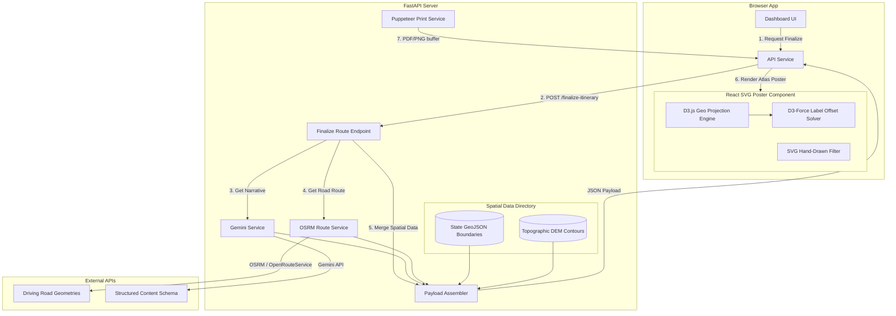

# Blueprint V3: Travel Atlas Poster Architecture

This document describes the high-fidelity system architecture for **Blueprint V3**. The goal of Blueprint V3 is to transform the existing abstract coordinate visualizer into a premium, printable cartographic travel atlas poster.

---

## 1. System Topology Overview

The Blueprint V3 architecture establishes a strict separation of concerns between **AI-generated textual insights**, **deterministic spatial data processing**, and **client-side cartographic projection rendering**.



---

## 2. API & Data Integration Specification

Blueprint V3 utilizes a robust hybrid API setup to achieve maximum geographic fidelity while remaining cost-effective:

| Component | Technology / API Provider | Purpose | Cost Implications |
| :--- | :--- | :--- | :--- |
| **Geocoding & POIs** | Nominatim (OpenStreetMap) | Resolving coordinate lookups for cart attractions. | Free (subject to 1 req/sec rate limit). |
| **Road Geometries** | Project OSRM / OpenRouteService | Fetching actual road networks and coordinates. | OSRM: Free (public instances). ORS: Free up to 2k req/day. |
| **State Boundaries** | Simplified OpenStreetMap Relations | Drawing outline contours for Meghalaya, Rajasthan, Kerala, and Sikkim. | Free (pre-processed and cached locally on the backend). |
| **Elevation Contours**| Shuttle Radar Topography Mission (SRTM) | Visualizing physical terrain topography. | Free (contour bands generated offline as static GeoJSON assets). |
| **Travel Text Narratives**| Gemini 1.5 Flash | Synthesizing seasonal tips, local cuisine recommendations, and weather narratives. | Free/Low cost via Google AI Studio API. |

---

## 3. Detailed Component Architecture

### A. Backend Data Aggregator
The backend endpoint `POST /api/finalize-itinerary` acts as the single orchestrator. It receives the selected cart items, resolves geocoded coordinates, and coordinates parallel queries:
1. **OSRM Route Client:** Queries OSRM for the sequence of geocoded stops, returning distance, duration, and the complete road geometry coordinate polyline: `[[lat_1, lon_1], [lat_2, lon_2], ...]`.
2. **Gemini Content Client:** Requests Gemini to generate descriptive narratives (see Section 5 below) based on the destination and itinerary context.
3. **Local GeoJSON Resolver:** Merges the boundary coordinates and elevation contours corresponding to the destination state. 
4. **Assembler:** Combines everything into a unified JSON schema, returning it to the client.

### B. D3.js Projection Engine (Frontend)
The frontend uses **D3.js (d3-geo)** to project coordinates onto the SVG canvas:
* **Projection Selection:** **Transverse Mercator** (`d3.geoTransverseMercator()`) or **Conic Conformal** (`d3.geoConicConformal()`) projections are used. The projection is centered on the geographic bounding box of the active state.
* **Auto-Scaling:** Using `projection.fitSize([800, 460], geojson)`, D3 dynamically scales the boundaries, topography contours, road coordinates, and attraction markers to fit the canvas dimensions perfectly, with pre-configured padding:
  ```javascript
  const projection = d3.geoConicConformal()
    .center([stateLon, stateLat])
    .fitSize([800, 460], stateGeoJson);
  const pathGenerator = d3.geoPath().projection(projection);
  ```

### C. D3 Force-Directed Label Solver
To prevent text labels of nearby landmarks from overlapping, a D3 force simulation (`d3-force`) runs client-side:
* Marker nodes are anchored to their projected coordinates.
* Label nodes are assigned repulsive forces (`d3.forceCollide()`).
* The engine runs for a small number of iterations (e.g. 50 ticks) to offset text labels dynamically while keeping them visually connected to their markers via pointer lines.

---

## 4. Visual Rendering & Styling Pipeline

To deliver a premium **travel atlas poster** aesthetic, the SVG uses layered elements styled with inline CSS:

* **Layer 1: Parchment Background:** An SVG `<rect>` filled with `#FAF7F2` overlayed with a radial gradient simulating aged paper.
* **Layer 2: Topographic Fills:** Simplified contour bands rendered as filled polygons. Each band is assigned a color offset based on its elevation (e.g., deeper shades of emerald `#043e30` for low valleys, transitioning to light mist gray `#e6eceb` for Himalayan heights).
* **Layer 3: State Boundary Border:** A double-stroke outer border representing the state's geographic limits.
* **Layer 4: Road Networks:** OSRM geometry paths drawn with dashed strokes. A **SVG Turbulence Filter** is applied to road elements to distort straight lines slightly, mimicking hand-inked cartography:
  ```xml
  <filter id="hand-drawn-ink">
    <feTurbulence type="fractalNoise" baseFrequency="0.04" numOctaves="3" result="noise" />
    <feDisplacementMap xChannelSelector="R" yChannelSelector="G" scale="2" in="SourceGraphic" in2="noise" />
  </filter>
  ```
* **Layer 5: Custom Vector Symbols:** Custom SVG icons are drawn for different categories (e.g., a suspension bridge icon for Nongriat's root bridge, a cave mouth icon for Mawsmai, a waterfall icon for Krang Suri).
* **Layer 6: Typography Overlay:** All text is rendered using beautiful editorial fonts (*Cinzel* or *Playfair Display* for titles, *Outfit* or *Inter* for coordinate grids and stats).

---

## 5. Gemini Integration & Separation of Responsibilities

To ensure maximum system robustness, Gemini is strictly quarantined to generating unstructured narrative content and is prohibited from processing spatial geometry.

### Separation Matrix
```
┌───────────────────────────────────────┐
│         GEMINI RESPONSIBILITIES       │
├───────────────────────────────────────┤
│ ✔ Weather & Seasonal Narratives       │
│ ✔ Terrain & Travel Expectation Text   │
│ ✔ Local Dining & Cuisine Lists        │
│ ✔ Destination Safety & Pack Lists     │
└───────────────────────────────────────┘
                   │  (Strict Separation)
                   ▼
┌───────────────────────────────────────┐
│        DETERMINISTIC CODE / APIs      │
├───────────────────────────────────────┤
│ ✘ Drawing Maps & Boundaries (D3/JSON) │
│ ✘ Road Calculations (OSRM)            │
│ ✘ Scaling Coordinates (D3-Geo)        │
│ ✘ Measuring Distances & Times (OSRM)  │
└───────────────────────────────────────┘
```

---

## 6. Export System & Print Pipeline

To deliver print-quality outputs (e.g. A3 paper sizes at 300 DPI for framing):

### A. Pure SVG Download (Infinite Vector)
The client pulls the rendered `<svg>` element from the DOM, embeds base64-encoded WOFF2 files of the custom fonts, and saves the file directly as a `.svg`. Because it is fully vector-based, the poster can be blown up to billboard size with zero pixelation.

### B. High-Resolution PDF/PNG Renderer (Puppeteer backend)
Because client-side canvas capture (`html2canvas`) fails on external image sources (CORS blocks) and has low screen-resolution scaling:
1. The client requests a PDF/PNG export by passing the trip state JSON to `/api/blueprint/print-pdf`.
2. The backend launches a headless browser via **Puppeteer**.
3. Puppeteer loads the poster markup inside an exact viewport size matching standard print sizes (e.g. A3 size at 300 DPI is $3508 \times 4960$ pixels).
4. The backend prints the page buffer (`page.pdf()`) or saves a screenshot (`page.screenshot()`) and returns the binary stream to the browser for instant client downloading.
