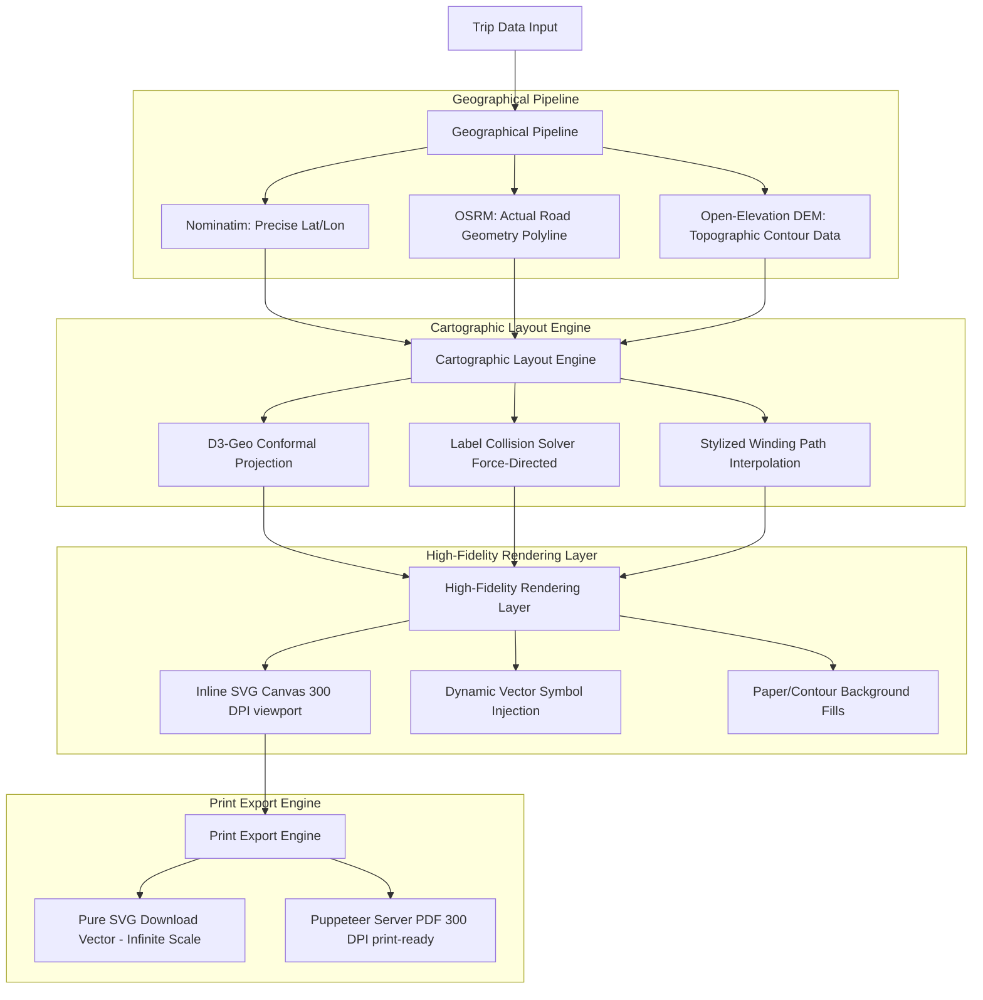

# Map Provider Audit & Poster Architecture Recommendation

This document audits the current architecture of the **AI Trip Planner** mapping system, specifically looking at how the **Blueprint Exploration Poster** is generated, coordinates are projected, routing is drawn, and graphics are rendered. It concludes with an architectural blueprint for generating a high-quality, printable **Meghalaya-style travel atlas poster**.

---

## Part 1: Current Blueprint Map Audit

The **Blueprint Map** is a client-side vector visualization designed to look like a vintage travel poster. Below is the step-by-step breakdown of how it is currently produced.

### 1. Data Source
* **Primary Source:** The map is driven entirely by client-side React props (`activeTrip` and `selectedPlaces`).
* **Fallback Mechanisms:** 
  * If the user's selected places cart (`selectedPlaces`) is empty, the component falls back to extracting up to the first 5 locations from `activeTrip.nearby_attractions` (which are previously fetched via the backend or mock presets).
  * If those are empty, it loads a hardcoded list of attractions based on the destination name. For example, if the destination matches `"meghalaya"`, it loads: *Elephant Falls, Laitlum Canyons, Mawsmai Cave,* and *Dawki River*.
* **Dynamic Content Extraction:** The base city name, weather summaries, packing items, travel tips, and safety notices are resolved dynamically via helper mapping functions in [blueprintProvider.js](file:///c:/Users/Sourav%20Haldar/Documents/AI%20Works/AI-Trip-Planner/frontend/src/services/blueprintProvider.js) and [BlueprintV2.jsx](file:///c:/Users/Sourav%20Haldar/Documents/AI%20Works/AI-Trip-Planner/frontend/src/components/BlueprintV2.jsx) using lowercase checks on the destination string.

### 2. Coordinate Source
* **Primary Coordinates:** The component reads geographical latitude and longitude values from the places in the cart: `place.lat || place.coords?.[0]` and `place.lon || place.coords?.[1]`.
* **Fallback Offsets:** If a place does not have geographical coordinates, the component dynamically generates offset coordinates based on the index:
  $$\text{lat} = 25.5 - (\text{index} \times 0.1)$$
  $$\text{lon} = 91.8 + (\text{index} \times 0.12)$$
* **Grid Projection Logic:** 
  * The latitude and longitude coordinates of the selected places are aggregated to compute the geographical boundary bounding box ($\min$, $\max$).
  * These coordinates are mapped linearly into a 2D viewport coordinates system of $800 \times 460$ pixels with an $X$-padding of $110\text{px}$ and $Y$-padding of $80\text{px}$.
  * The $Y$-coordinate is inverted (subtracted from the viewport height) to match computer graphics coordinate standards where the origin $(0,0)$ is in the top-left corner, whereas northmost latitudes grow upwards:
    $$X = \text{paddingX} + \frac{\text{lon} - \text{minLon}}{\text{maxLon} - \text{minLon}} \times (\text{width} - 2 \times \text{paddingX})$$
    $$Y = \text{paddingY} + (\text{height} - 2 \times \text{paddingY}) - \frac{\text{lat} - \text{minLat}}{\text{maxLat} - \text{minLat}} \times (\text{height} - 2 \times \text{paddingY})$$
* **Alternative Service (`posterBuilder.js`):** The application has a standalone service called [posterBuilder.js](file:///c:/Users/Sourav%20Haldar/Documents/AI%20Works/AI-Trip-Planner/frontend/src/services/blueprint/posterBuilder.js). If invoked, it bypasses actual geographic coordinates entirely and relies on a hardcoded winding loop of coordinates:
  ```javascript
  const presetCoords = [
    { x: 180, y: 250 }, // Base City (Center-Left)
    { x: 260, y: 130 }, // Stop 1 (Top-Left)
    { x: 420, y: 110 }, // Stop 2 (Top-Center)
    { x: 550, y: 150 }, // Stop 3 (Top-Right)
    { x: 590, y: 260 }, // Stop 4 (Center-Right)
    { x: 510, y: 370 }, // Stop 5 (Bottom-Right)
    { x: 350, y: 380 }, // Stop 6 (Bottom-Center)
    { x: 230, y: 330 }  // Stop 7 (Bottom-Left)
  ];
  ```

### 3. Routing Source
* **Routing Calculation:** There is **no real routing service (OSRM or Google Maps)** used to draw the path on the Blueprint map.
* **Path Generation:** The path is visually simulated in SVG using **Cubic Bezier Curves** between sequentially ordered locations. It computes a midpoint and offsets the $Y$ control point upwards by $35\text{px}$ to create a sweeping curved connection:
  $$\text{Path} = M(x_1, y_1) \rightarrow C\left(\frac{x_1 + x_2}{2}, \frac{y_1 + y_2}{2} - 35, \frac{x_1 + x_2}{2}, y_2, x_2, y_2\right)$$
  This path is decorated with dashed strokes: `stroke="#B45309" strokeWidth="3.5" strokeDasharray="8 6"`.
* **Distance Matrix Source:** The distances shown in the "Distance Summary Matrix" side-panel are **fake**. They are generated dynamically via:
  $$\text{distance} = 20 + \text{random}(0, 45) \text{ km}$$

### 4. Rendering Source
* **Map Rendering:** Rendered directly in the client browser inside the React virtual DOM tree as an inline `<svg>` element with `viewBox="0 0 800 460"`.
* **UI Themes:** Standard SVG styling properties apply color variables (e.g. amber, emerald, brown) dynamically based on the active provider selection (`classic-cartographic`, `openai-ink-minimalist`, or `gemini-neon-cyber`).
* **Grid Background Pattern:** Produced using an SVG `<pattern>` element generating a graticule overlay at a density of $40\text{px}$ intervals with $8\%$ opacity.
* **Polaroids:** Real HTML image components featuring Unsplash photos or fallback category-matched placeholders. They are offset and rotated via CSS styles (`transform: rotate(-4deg)`) and styled with a yellow tape-ribbon overlay.
* **Exporting Framework:** hand-off to [exportManager.js](file:///c:/Users/Sourav%20Haldar/Documents/AI%20Works/AI-Trip-Planner/frontend/src/services/blueprint/exportManager.js).
  * **PNG/JPG:** Uses `html2canvas` to capture the DOM structure, rasterize it into a high-scale canvas (`scale: 2`), and download the canvas buffer.
  * **PDF:** Opens a popup browser context (`about:blank`), copies the raw inner HTML of the poster element, injects Tailwind CSS stylesheets, and calls `window.print()`.

---

## Part 2: Meghalaya-Style Travel Atlas Poster Architecture

A **Meghalaya-Style Travel Atlas Poster** demands a premium cartographical aesthetic reflecting the state's natural features—winding mountain roads, rain-drenched valleys, limestone caves, living root bridges, and high gorges. It must be highly detailed, geographically authentic, and print-ready (suitable for poster framing).

### Aesthetic Inspiration
* **Color Palette:** Warm cream/parchment background (`#FAF7F2`), forest green contour fills (`#064E3B`), and copper/gold path overlays (`#D97706`).
* **Visual Layers:** Stylized topographic contour loops representing the Khasi and Jaintia hills, organic river vectors, and custom illustrated icon markers.
* **Editorial Typography:** Elegant, high-end editorial serifs for headers (*Playfair Display* or *Cinzel*) combined with clean geometric sans-serif details for coordinates and labels (*Outfit* or *Inter*).

---

### Recommended Component Architecture

We recommend the **"Topo-Carto Vector Poster Pipeline" (TCV-PP)**, which splits the generation into a geographic data resolver, a vector cartography compiler, and a vector output rendering layer:



---

### Technical Specification & Stack

#### 1. Data & Routing Layer
* **Actual Road Paths:** Replace the cubic Bezier curves with actual road shapes. Query the **OSRM Route API** (`/route/v1/driving`) requesting full geometry coordinates (`overview=full&geometries=geojson`).
* **Topography Contours:** Query a Digital Elevation Model (DEM) database (e.g., Open-Elevation or SRTM datasets) for a grid centered on the trip's bounding box. Generate contour lines representing elevation bands.
* **Geographical Distances:** Compute exact driving distances between sequential destinations directly from the OSRM route duration/distance summary instead of generating random values.

#### 2. Projection & Cartography Layer (D3.js)
* **Projection Projection:** Use **D3.js (d3-geo)** client-side to project raw lat/lon coordinates. A **Conic Conformal Projection** (or *Transverse Mercator*) centered on Meghalaya coordinates ($25.57^\circ\text{ N}, 91.88^\circ\text{ E}$) ensures minimal spatial distortion.
* **Collision Detection:** Use a **D3 Force-Directed Simulation (d3-force)** to offset label names. This prevents text overlap in dense clusters (e.g., having Shillong, Laitlum, and Mawphlang in close proximity).

#### 3. Graphic & Rendering Layer (SVG Core)
* **Base Map Textures:** Use nested SVG `<path>` elements filled with multi-opacity forest greens to represent altitude layers (elevations) and water body paths.
* **Custom Illustrated Symbol Overlays:** Inject specialized SVGs based on attraction taxonomy:
  * `waterfall` $\rightarrow$ Cascading river stream symbol.
  * `cave` $\rightarrow$ Archaic cave mouth vector.
  * `bridge` $\rightarrow$ Stylized living root bridge illustration.
* **Winding Roads Styling:** Stroke OSRM paths using SVG filters to simulate a "hand-inked" drawing look:
  ```xml
  <filter id="hand-drawn-ink">
    <feTurbulence type="fractalNoise" baseFrequency="0.04" numOctaves="3" result="noise" />
    <feDisplacementMap xChannelSelector="R" yChannelSelector="G" scale="2.5" in="SourceGraphic" in2="noise" />
  </filter>
  ```

#### 4. Export & Print-Ready Engine (SVG Vector & Puppeteer)
To support true print-ready framing:
* **Vector Vector Export:** Compile the inline SVG DOM, inline the Google Fonts (converted to base64 WOFF2), and download it directly as a `.svg` file. This lets users scale it to poster size (e.g., A1 or A2) without pixelation.
* **High-Res PDF Rendering:** Build a lightweight backend endpoint `/api/blueprint/print-pdf`. When requested, launch a headless browser instances via **Puppeteer**, load the poster layout inside a high-DPI viewport size, and print to file:
  ```javascript
  await page.pdf({
    path: 'meghalaya-atlas.pdf',
    format: 'A3',
    printBackground: true,
    margin: { top: '0px', right: '0px', bottom: '0px', left: '0px' }
  });
  ```
